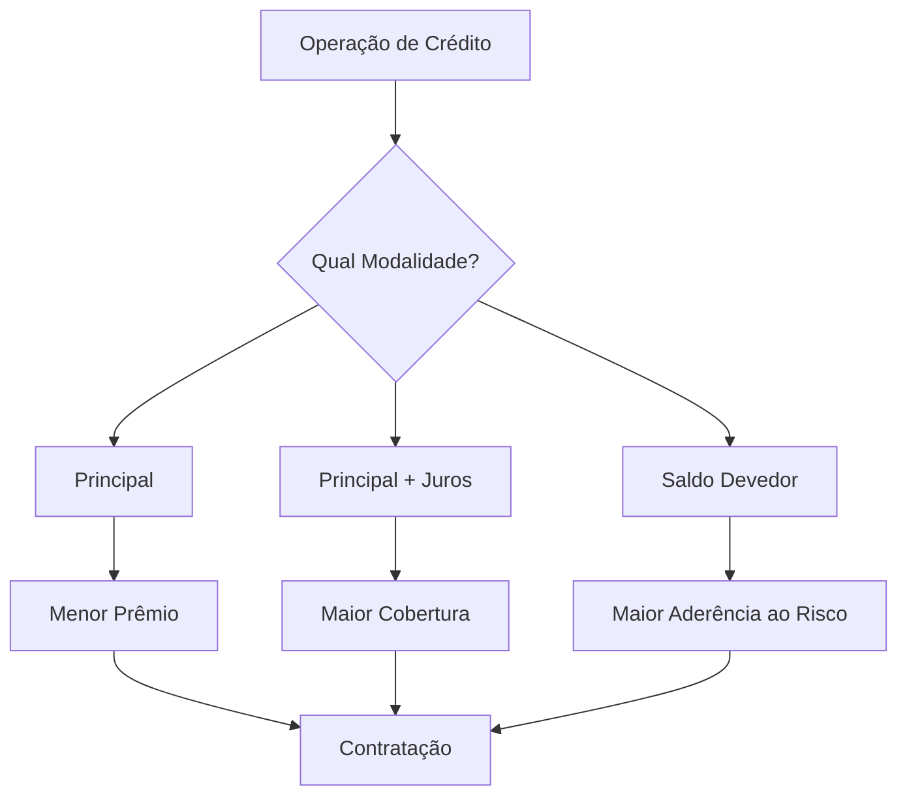

# Fluxo Operacional 03

# Escolha da Modalidade de Capital Segurado

## Objetivo

Orientar a seleção da modalidade de cobertura mais adequada para cada operação.

---

---

# Critérios de Escolha

## Principal

Quando utilizar:

* Operações simples
* Busca por menor custo

---

## Principal + Juros

Quando utilizar:

* Maior proteção
* Operações de longo prazo

---

## Saldo Devedor

Quando utilizar:

* Proteção aderente ao risco
* Carteiras com acompanhamento periódico

---

# Pontos de Atenção

* Capital segurado
* Prazo da operação
* Perfil do cooperado
* Política da cooperativa
