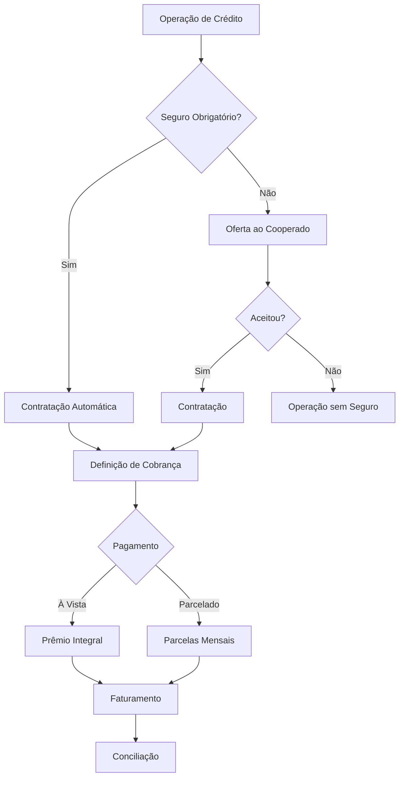

# Fluxo Operacional 04

# Parametrizações da Cooperativa

## Objetivo

Demonstrar como as parametrizações influenciam a contratação e a cobrança do seguro.

---

# Pontos de Controle

## Contratação

* Seguro obrigatório ou opcional.
* Registro da adesão.

## Cobrança

* À vista.
* Parcelado.

## Faturamento

* Conferência das parcelas.

## Conciliação

* Validação dos valores arrecadados.

---

# Indicadores Recomendados

* Percentual protegido.
* Taxa de adesão.
* Percentual bonificado.
* Cobranças inconsistentes.
* Índice de conciliação.
