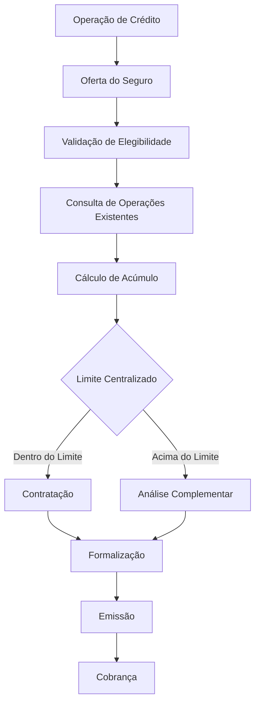

# Fluxo Operacional 05

# Contratação e Limite Centralizado

## Objetivo

Demonstrar o fluxo de contratação e a validação da exposição do segurado.

---

# Pontos de Controle

## Elegibilidade

* Produto elegível.
* Perfil do cooperado.

## Exposição

* Operações existentes.
* Capital acumulado.

## Limite

* Verificação do limite centralizado.

## Formalização

* Documentação correta.

---

# Indicadores Recomendados

* Operações contratadas.
* Exposição média por cooperado.
* Limites excedidos.
* Operações pendentes de análise.
* Percentual de contratação.
