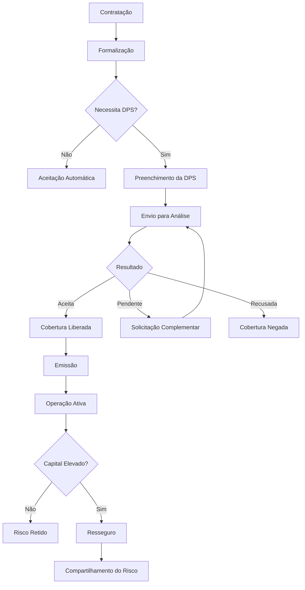

# Fluxo Operacional 06

# Formalização, DPS e Resseguro

## Objetivo

Demonstrar o fluxo completo de formalização e análise da DPS.

---

# Pontos de Controle

## Formalização

* Assinatura válida.
* Documentação completa.

## DPS

* Prazo de análise.
* Pendências.

## Resseguro

* Capitais elevados.
* Exposição concentrada.

---

# Indicadores Recomendados

* DPS pendentes.
* Tempo médio de análise.
* Propostas aceitas.
* Propostas recusadas.
* Operações com resseguro.
