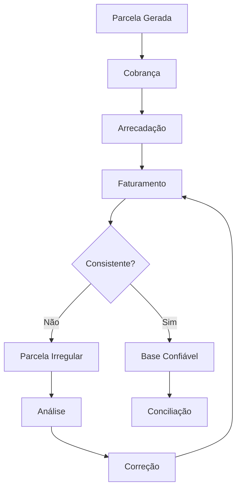

# Fluxo Operacional 08

# Consistência das Parcelas

## Objetivo

Demonstrar a validação operacional das parcelas antes da conciliação.

---

# Pontos de Controle

## Cobrança

* Parcela gerada corretamente.

## Arrecadação

* Valor recebido.

## Faturamento

* Registro financeiro correto.

## Consistência

* Validação cruzada das informações.

---

# Indicadores Recomendados

* Parcelas irregulares.
* Valor irregular.
* Tempo de regularização.
* Percentual consistente.
* Tendência de inconsistências.
