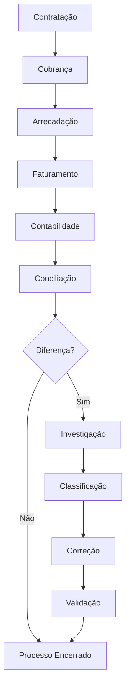

# Fluxo Operacional 09

# Faturamento e Conciliação Contábil

## Objetivo

Demonstrar o fluxo de validação financeira da carteira Prestamista.

---

# Pontos de Controle

## Arrecadação

* Valor recebido.

## Faturamento

* Valor reconhecido.

## Contabilidade

* Valor contabilizado.

## Conciliação

* Comparação das fontes.

---

# Indicadores Recomendados

* Percentual conciliado.
* Divergência financeira.
* Quantidade de ocorrências.
* Tempo médio de regularização.
* Valor recuperado.

---

# Conexão com o Módulo 10

O Módulo 10 será uma **Oficina do Especialista**, onde o participante utilizará os conhecimentos dos nove módulos anteriores para resolver casos completos envolvendo:

* Contratação
* DPS
* Cobrança
* Cancelamentos
* Consistência
* Faturamento
* Conciliação

simulando situações reais enfrentadas pela operação da Sicoob Seguradora.
