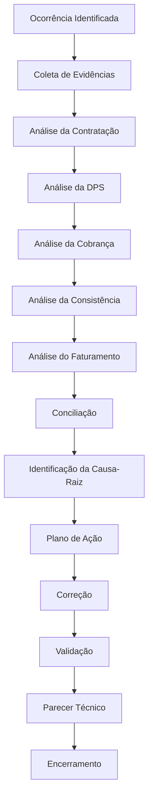

# Fluxo Operacional 10

# Oficina do Especialista

## Objetivo

Demonstrar a jornada completa de investigação de uma ocorrência Prestamista.

---

# Competências Avaliadas

## Técnica

* Conhecimento do produto.
* Conhecimento operacional.

## Analítica

* Investigação.
* Priorização.

## Executiva

* Comunicação.
* Construção de pareceres.

---

# Resultado Esperado

Ao concluir o Módulo 10 o participante estará apto a atuar como:

### Especialista em Seguro Vida Prestamista

com visão completa do ciclo operacional, financeiro e analítico da carteira.
