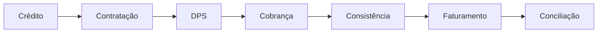

APOSTILA 01

# ESPECIALISTA EM SEGURO VIDA PRESTAMISTA

## MÓDULO 1

# O ECOSSISTEMA DO SEGURO VIDA PRESTAMISTA

---

## APRESENTAÇÃO

Bem-vindo à formação **Especialista em Seguro Vida Prestamista**.

Antes de estudarmos regras de aceitação, capital segurado, DPS, faturamento ou conciliação contábil, precisamos compreender o propósito do produto e o papel que ele desempenha dentro do cooperativismo financeiro.

Muitos profissionais conhecem apenas uma parte do processo. Alguns atuam na venda, outros na formalização, outros na cobrança ou na conciliação.

O especialista, entretanto, compreende toda a jornada.

Ao longo desta formação, vamos percorrer o caminho completo do seguro, desde a contratação da operação até o pagamento de eventual indenização.

---

# OBJETIVOS DE APRENDIZAGEM

Ao concluir esta apostila, você será capaz de:

* Explicar o que é o Seguro Vida Prestamista.
* Entender sua importância para o cooperado e para a cooperativa.
* Identificar os participantes do processo.
* Conhecer as coberturas do produto.
* Compreender o ciclo de vida do seguro.
* Entender como o seguro se conecta ao crédito.
* Reconhecer os riscos de uma operação sem cobertura.

---

# CAPÍTULO 1

# O QUE É O SEGURO VIDA PRESTAMISTA?

Imagine a seguinte situação:

João Pedro possui um financiamento de R$ 150.000,00 contratado junto à cooperativa.

Ele é responsável pelo sustento da família e possui uma renda estável.

Infelizmente, alguns meses após a contratação, ocorre seu falecimento.

Nesse momento surgem diversas perguntas:

* Quem pagará a dívida?
* A cooperativa absorverá o prejuízo?
* A família herdará a dívida?
* Haverá impacto financeiro para os dependentes?

É exatamente para responder essas questões que existe o Seguro Vida Prestamista.

O Seguro Prestamista é um produto destinado a proteger operações de crédito, garantindo a liquidação da dívida quando ocorre um evento coberto pelo contrato.

Dessa forma, o seguro protege simultaneamente:

* O cooperado;
* Seus familiares;
* A cooperativa;
* A carteira de crédito.

O produto é exclusivo para operações de crédito vinculadas às entidades do Sicoob.

---

# CAPÍTULO 2

# AS COBERTURAS DO PRODUTO

O Seguro Vida Prestamista possui duas coberturas principais.

## Morte (M)

Garantia do pagamento da indenização em caso de falecimento do segurado durante a vigência do seguro.

Essa é a cobertura mais utilizada.

Quando ocorre o falecimento, a seguradora realiza a indenização observando as regras contratuais e o capital segurado.

---

## Invalidez Permanente Total por Acidente (IPTA)

Garante a indenização quando o segurado sofre perda total e permanente da capacidade funcional em decorrência de acidente coberto.

O objetivo é preservar o patrimônio do cooperado quando ele perde a capacidade de gerar renda.

---

# CAPÍTULO 3

# QUEM É BENEFICIADO PELO PRODUTO?

Uma das características mais interessantes do Seguro Prestamista é que ele gera valor para todos os participantes envolvidos.

---

## Benefícios para o Cooperado

O cooperado obtém:

* Segurança financeira;
* Proteção patrimonial;
* Tranquilidade para sua família;
* Proteção contra eventos inesperados.

A contratação do seguro evita que uma situação já difícil seja agravada por problemas financeiros.

---

## Benefícios para a Família

A família passa a contar com proteção financeira.

Dependendo da modalidade contratada, pode existir inclusive valor remanescente para os beneficiários.

---

## Benefícios para a Cooperativa

A cooperativa obtém:

* Redução de perdas financeiras;
* Proteção da carteira de crédito;
* Menor inadimplência;
* Receita de comissionamento;
* Melhoria dos indicadores de risco.

---

## Benefícios para a Seguradora

A seguradora:

* Assume os riscos;
* Recebe os prêmios;
* Forma sua carteira;
* Gera resultado técnico.

---

# CAPÍTULO 4

# OS PARTICIPANTES DO ECOSSISTEMA

Para compreender o produto é fundamental entender quem participa do processo.

---

## Cooperado

É quem contrata a operação de crédito.

Também é chamado de segurado.

---

## Cooperativa

É quem:

* Origina a operação;
* Comercializa o seguro;
* Realiza a formalização;
* Efetua os controles operacionais;
* Realiza a conciliação financeira.

A cooperativa é um dos principais agentes do processo.

---

## Corretora Sistêmica

Responsável pelo apoio comercial e operacional.

Atua como elo entre cooperativa e seguradora.

---

## Sicoob Seguradora

É a responsável por assumir o risco segurado.

Suas responsabilidades incluem:

* Aceitação dos riscos;
* Emissão das coberturas;
* Regulação dos benefícios;
* Pagamento das indenizações.

---

## Ressegurador

Responsável por apoiar a seguradora em operações de maior valor.

Pode participar da análise e aceitação de riscos específicos.

---

# CAPÍTULO 5

# O CICLO DE VIDA DO SEGURO

O Seguro Prestamista possui um ciclo operacional completo.

Esse ciclo será estudado ao longo de toda a formação.

---

## Etapa 1 – Operação de Crédito

A cooperativa concede crédito ao cooperado.

---

## Etapa 2 – Contratação

O seguro é ofertado e contratado.

---

## Etapa 3 – Formalização

São coletadas:

* Proposta de adesão;
* DPS quando aplicável;
* Documentações complementares.

---

## Etapa 4 – Cobrança

O prêmio é cobrado.

Pode ocorrer:

* À vista;
* Parcelado.

---

## Etapa 5 – Consistência

As parcelas são verificadas.

Nesta etapa são identificadas:

* Parcelas enviadas;
* Parcelas não debitadas;
* Parcelas canceladas;
* Parcelas inconsistentes.

---

## Etapa 6 – Faturamento

É gerado o arquivo TXT enviado à seguradora.

---

## Etapa 7 – Conciliação

Os valores arrecadados precisam coincidir com os valores faturados.

Essa é uma das etapas mais importantes do processo.

---

## Etapa 8 – Sinistro ou Encerramento

A operação poderá:

* Encerrar normalmente;
* Ser liquidada antecipadamente;
* Gerar devolução de prêmio;
* Gerar pagamento de benefício.

---

# CAPÍTULO 6

# POR QUE A CONCILIAÇÃO É TÃO IMPORTANTE?

Muitos profissionais acreditam que o seguro termina quando a venda é realizada.

Na prática, a venda é apenas o início.

Imagine o seguinte cenário:

A cooperativa debitou o valor do seguro do cooperado.

Por algum motivo, essa parcela não foi enviada para faturamento.

Consequência:

* O cooperado pagou.
* A seguradora não recebeu.
* Pode não existir cobertura.

Portanto, a qualidade da conciliação financeira influencia diretamente a proteção do cooperado.

Esse será um dos temas mais importantes de toda a formação.

---

# EXEMPLO PRÁTICO

João contratou:

* Empréstimo: R$ 100.000
* Seguro Prestamista

Após dois anos ocorre seu falecimento.

A cooperativa comunica o sinistro.

A seguradora analisa a documentação.

A indenização é paga conforme as condições contratadas.

A dívida é liquidada.

O patrimônio da família é preservado.

---

# ESTUDO DE CASO

A Cooperativa Alfa possui uma carteira de crédito de R$ 80 milhões.

Um cooperado possui:

* Financiamento: R$ 300.000
* Seguro Prestamista ativo

O cooperado falece.

Perguntas:

1. Qual é o objetivo do Seguro Prestamista neste caso?
2. Quem é protegido?
3. Qual benefício é gerado para a cooperativa?
4. Qual benefício é gerado para a família?
5. O que aconteceria se a operação estivesse sem cobertura?

---

# RESUMO EXECUTIVO

* O Seguro Prestamista protege operações de crédito.
* As coberturas básicas são Morte e IPTA.
* O produto beneficia cooperado, família, cooperativa e seguradora.
* A cooperativa desempenha papel central na operacionalização.
* O seguro possui um ciclo de vida completo.
* A conciliação financeira é fundamental para garantir a efetiva cobertura das operações.
* O especialista precisa compreender todas as etapas do processo.

---

# GLOSSÁRIO

### Prestamista

Pessoa vinculada a uma dívida protegida pelo seguro.

### Segurado

Pessoa sobre a qual o risco é avaliado.

### Capital Segurado

Valor máximo coberto pelo seguro.

### Prêmio

Valor pago pela contratação do seguro.

### Beneficiário

Quem receberá eventual indenização.

### Sinistro

Ocorrência do evento coberto.

### DPS

Declaração Pessoal de Saúde.

### Indenização

Valor pago pela seguradora quando ocorre o evento coberto.

---

# CHECKLIST DO ESPECIALISTA

Após concluir esta apostila eu consigo:

✅ Checklist Explicar o conceito do Seguro Prestamista

✅ Explicar suas coberturas

✅ Explicar quem participa do processo

✅ Explicar o ciclo de vida do seguro

✅ Explicar os benefícios para o cooperado

✅ Explicar os benefícios para a cooperativa

✅ Explicar a importância da conciliação

✅ Relacionar o seguro com a operação de crédito

---

<!--
# QUIZ

### 1. Qual é o principal objetivo do Seguro Prestamista?

a) Financiar operações

b) Garantir pagamento da dívida em caso de evento coberto

c) Reduzir juros

d) Aumentar limite de crédito

---

### 2. Quais são as coberturas básicas do produto?

a) Incêndio e Roubo

b) Morte e IPTA

c) Desemprego e Doença

d) Acidentes pessoais

---

### 3. Quem assume o risco segurado?

a) Cooperado

b) Cooperativa

c) Seguradora

d) Corretora

---

### 4.

Qual o principal benefício para a cooperativa?

a) Aumento de patrimônio

b) Proteção da carteira de crédito

c) Redução de impostos

d) Redução de tarifas

---

### 5.

O que é prêmio?

a) Valor da indenização

b) Valor da dívida

c) Valor pago pelo seguro

d) Valor da comissão

---

### 6.

Quem é o segurado?

a) Corretora

b) Seguradora

c) Cooperativa

d) Pessoa sobre a qual o risco é avaliado

---

### 7.

Qual etapa ocorre antes do faturamento?

a) Sinistro

b) Consistência

c) Devolução

d) Regulação

---

### 8.

A conciliação tem como objetivo principal:

a) Emitir propostas

b) Validar documentos

c) Garantir compatibilidade entre arrecadação e faturamento

d) Realizar sinistros

---

### 9.

Quem comercializa o produto junto ao cooperado?

a) Banco Central

b) SUSEP

c) Cooperativa

d) Ressegurador

---

### 10.

O especialista deve compreender:

a) Apenas a venda

b) Apenas a cobrança

c) Apenas a conciliação

d) Todo o ciclo operacional

---

# GABARITO

1-B

2-B

3-C

4-B

5-C

6-D

7-B

8-C

9-C

10-D
-->