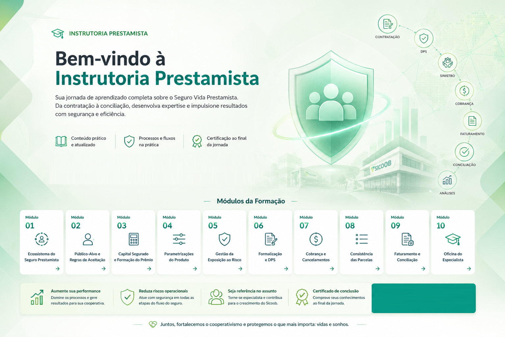

# 🎓 Instrutoria Prestamista

## Domine o Seguro Vida Prestamista do início ao fim

Capacitação completa sobre contratação, aceitação, cobrança, faturamento, consistência e conciliação do Seguro Vida Prestamista.

<a href="https://evolares.github.io/instrutoria-prestamista/apoio/inscricao/"
   class="md-button md-button--primary">
🚀 Realizar Inscrição
</a>

<a href="https://evolares.github.io/instrutoria-prestamista/avaliacoes/diagnostico/"
   class="md-button">
📋 Teste de Diagnóstico
</a>

## O que você aprenderá?

- Módulo 01 – Fundamentos do Seguro Prestamista
- Módulo 02 – Público-Alvo e Regras de Aceitação
- Módulo 03 – Capital Segurado e Formação do Prêmio
- Módulo 04 – Parametrizações do Produto
- Módulo 05 – Gestão da Exposição ao Risco
- Módulo 06 – Formalização e DPS
- Módulo 07 – Cobrança, Cancelamentos e Devoluções
- Módulo 08 – Consistência das Parcelas
- Módulo 09 – Faturamento e Conciliação Contábil
- Módulo 10 – Oficina do Especialista